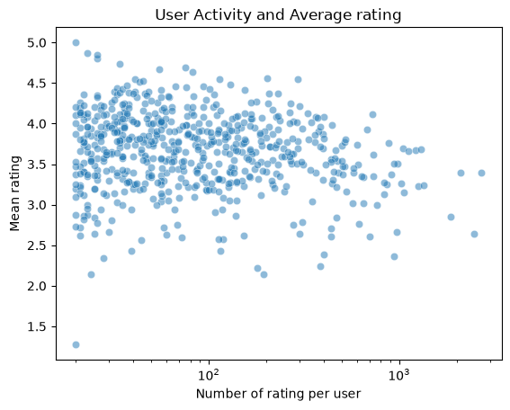

# Movie_Recommendation_System
A reproducible top-K movie recommendation pipeline built with Python and the MovieLens Latest Small dataset. The project currently compares popularity, content-based, and hybrid recommenders using a shared temporal evaluation framework.

Matrix factorization, two-tower retrieval, additional diversity analysis, and application deployment are planned extensions.
# Data 
This project uses the MovieLens Latest Small dataset and original dataset from GroupLens.
Citation:
> F. Maxwell Harper and Joseph A. Konstan. 2015. The MovieLens Datasets: History and Context. ACM Transactions on Interactive Intelligent Systems (TiiS) 5, 4: 19:1–19:19. <https://doi.org/10.1145/2827872>

Download:
https://grouplens.org/datasets/movielens/latest/ 

Extract the files to:
data/ml-latest-small
data/ml-latest

## MovieLens Latest Small dataset

| File | Description|
| ----------- |:-----------:|
| ratings.csv | user ratings and timestamps |
| movies.csv | Movie titles and genres |
| tags.csv | User-generated movie tags |
|links.csv | links to the movie in IMDb and TMDb |

# Dataset Summary
| Statistic        | Value      | 
| ------------- |:-------------:| 
| Users      | 610| 
| Rated movies     | 9724      | 
| Ratings | 100836      | 
| Mean ratings | 3.50 |

# EDA findings
- User-level mean ratings are generally concentrated between 3.3 to 4.0
- Some users assign lower or higher ratings, suggesting the presence of generous and strict rating behavior
- More active users appear to give lower average ratings than less active users.

Can see figures of user activities and user averages in [reports/figures/](reports/figures/)

